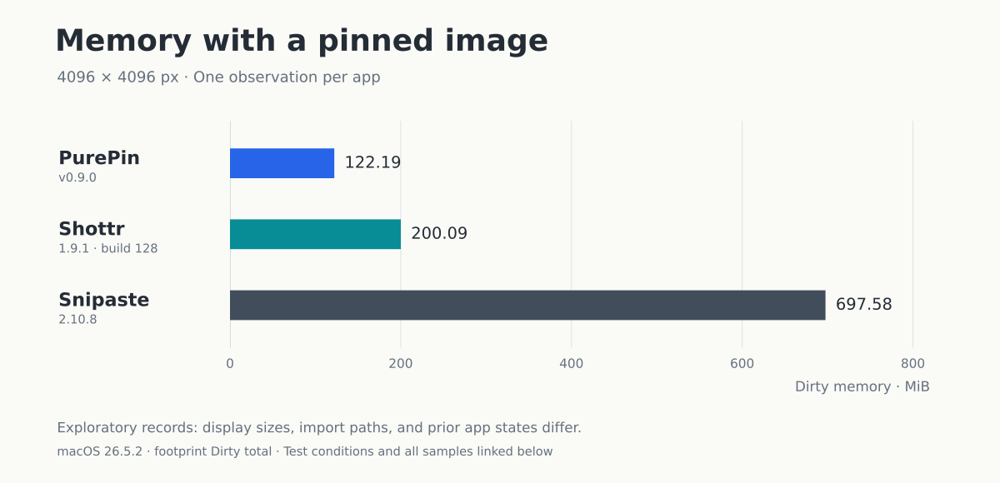

# PurePin

### Capture. Edit. Pin.

极简、原生的 macOS 截图工具。

[English](README.md) · 简体中文

For those tired of signing in, dismissing upgrade prompts, 
and digging through features just to take a screenshot.

 

| Capture | Edit | Pin |
| :--- | :--- | :--- |
| 区域、窗口区域或整屏截图，支持精细调整选区。 | 在选区内直接标注。箭头、文字、画笔，支持撤销与重做。 | 将截图或剪贴板图片置顶，拖动、缩放，一键隐藏或恢复。 |

无账户，无云端历史。截图和图像处理都在本机完成。[隐私说明 →](PRIVACY.zh-CN.md)

## 内存实测

三个场景，各连续截图 20 次；结束后 20 秒空闲阶段的内存中位数为 **35.1–35.7 MiB**。

使用带测量插桩的 Release 构建。图中为每轮关闭后的内存；截图可见时，采样最高值为 101–105 MiB。[测试方法与数据 →](docs/memory-report.zh-CN.md)

### 大图贴图：PurePin、Shottr、Snipaste

4096 × 4096 px 彩色测试图，贴图时的进程内存。每款各记录一次，版本见图中标注。

测量口径为 macOS `footprint` 的 Dirty 合计。三款的贴图显示尺寸、导入路径和此前使用状态不同，这组记录仅供参考。[测试条件与完整记录 →](docs/competitor-memory-observations.zh-CN.md)

## 获取 PurePin

[下载 PurePin →](https://github.com/easyrev/PurePin/releases)

**macOS 26+** · Apple Silicon 版 / Universal 版（Apple Silicon + Intel）

## 快捷键

首次截图时，需要在系统设置的 **隐私与安全性 → 屏幕与系统音频录制** 中允许 PurePin。这个权限用于获取静态截图；应用不录制音频，也不需要辅助功能、相机或麦克风权限。

| 想做什么 | 默认快捷键 |
| :--- | :--- |
| 开始截图 | <kbd>F1</kbd> |
| 贴出剪贴板中的图片 | <kbd>F3</kbd> |
| 隐藏 / 恢复全部贴图 | <kbd>⇧</kbd> + <kbd>F3</kbd> |
| 复制当前截图并结束编辑 | <kbd>Return</kbd> 或 <kbd>⌘</kbd> + <kbd>C</kbd> |
| 把当前截图贴在屏幕上 | <kbd>⌘</kbd> + <kbd>T</kbd> |
| 保存 PNG | <kbd>⌘</kbd> + <kbd>S</kbd> |
| 撤销 / 重做 | <kbd>⌘</kbd> + <kbd>Z</kbd> / <kbd>⇧</kbd> + <kbd>⌘</kbd> + <kbd>Z</kbd> |

功能键被系统占用时，试试加上 <kbd>fn</kbd> / 地球仪键，或在 Settings 中换成顺手的快捷键。

贴图可以拖动位置、滚动缩放，双击关闭；右键菜单里可以复制、保存或恢复原尺寸。

---

[获取 PurePin](#获取-purepin) · [隐私](PRIVACY.zh-CN.md) · [使用与反馈](SUPPORT.zh-CN.md)

PurePin 目前闭源，此仓库用于分发与反馈。Copyright © 2026 PurePin.

