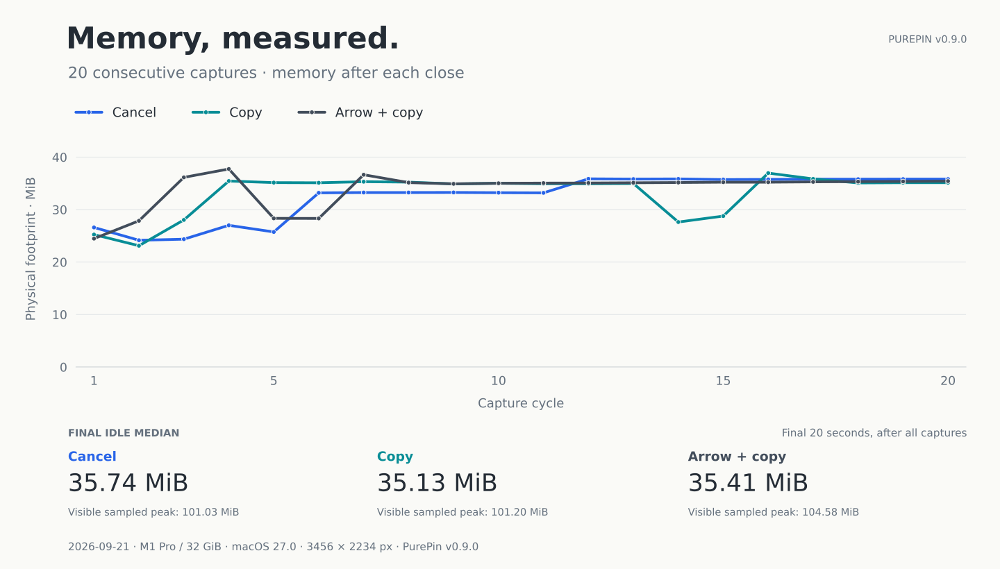

# Memory, measured.

[English](memory-report.md) · 简体中文

2026 年 9 月 21 日，我们在同一台 Mac 上分别连续执行了 20 次截图后取消、截图后复制和箭头标注后复制。三组结束后的 20 秒空闲阶段，进程物理占用中位数为 **35.13–35.74 MiB**。



这是带测量插桩的 Release 构建记录。它说明这些具体场景里发生了什么，不将数值作为普通发行版本的固定占用或性能排名。

## 测了什么

| 条件 | 本轮记录 |
| :--- | :--- |
| 机器 | Apple M1 Pro，32 GiB，arm64 |
| 系统 | macOS 27.0，build 26A428 |
| 开发环境 | Xcode 27.0 (27A266a)，macOS SDK 27.0 |
| 应用 | PurePin v0.9.0，Release，开启 `PUREPIN_BENCHMARK` |
| 源码版本 | `3bcca66db56578736a0821972b8b50680aa9fa08`，干净构建 |
| 屏幕 | 1728 × 1117 points，3456 × 2234 pixels，2× |
| 输入 | 真实捕获当前显示器；程序化选择宽、高各约 60% 的区域；标注场景加入一支箭头 |
| 会话 | 每个场景从一个独立新进程开始，各执行 20 轮 |
| 时间 | 启动后空闲 8 秒；每轮可见 1 秒、关闭后观察 6 秒；最后空闲观察 20 秒 |
| 采样 | 约每 100 ms 读取一次 `task_vm_info.phys_footprint` |

**MiB = 1,048,576 bytes。** 这里报告进程的 physical footprint，不使用 RSS，也不把它解释为整机内存成本。图中每个点是对应轮次关闭阶段的最后一个采样值；三条线均保留完整的 20 轮数据，没有平滑。

## 结果

| 场景 | 启动空闲中位 | 末五轮关闭中位（范围） | 末尾空闲中位 | 可见阶段采样最高 |
| :--- | ---: | ---: | ---: | ---: |
| 截图后取消 | 13.52 | 35.80 (35.75–35.81) | 35.74 | 101.03 |
| 截图后复制 | 13.56 | 35.13 (35.08–36.95) | 35.13 | 101.20 |
| 箭头标注后复制 | 13.58 | 35.33 (35.22–35.42) | 35.41 | 104.58 |

表中单位均为 MiB。可见阶段的数值是**采样最高值**，不代表内核记录的进程生命周期峰值。末尾空闲中位数来自独立的最后 20 秒观察期，并非对图中 20 个点取中位数。

前五轮与末五轮关闭中位数分别为 25.74→35.80、28.03→35.13 和 28.33→35.33 MiB。前期存在增长，后段接近平台；这组记录没有给出任意场景下的通用内存上限。

60 轮均通过完整性和规定采样点的资源释放检查：关闭后 +1 秒、+5 秒、每轮最后关闭样本及最终空闲样本中，编辑器、编辑视图与在途工作均已结束。复制与标注复制场景也检查了剪贴板变化及 PNG 输出。所有采样中的 Pin 数量均为 0。

## 这些数据的范围

每个场景只有一个进程会话，同一会话里的 20 轮并非 20 次独立实验。测试使用真实桌面捕获，没有记录一套跨场景固定的公开输入素材。机器、系统、显示分辨率和内容变化都可能影响结果。

本轮未测长期混合负载、贴图存活时的内存、多显示器切换、睡眠唤醒或严重内存压力，也没有测物理按键到画面呈现的延迟。带插桩的 Release 与普通发行二进制有区别；这里不据此声称“始终低于某个数值”“零泄漏”或优于其他产品。

诊断工具 `leaks` 报告了约 21–23 KiB 的候选，并提示目标不可调试、可读内存受限。应用会话对象通过释放检查，不等于已经排除了所有泄漏。与 9 月 12 日旧系统、旧任务的记录也不构成受控的优化前后对照。

## 数据与图表

[脱敏数据 JSON](data/memory-2026-09-21.json) 包含全部 60 个绘图值、统计量、构建身份、实验条件和原始文件 SHA-256。数字从本地完整 CSV 与汇总结果核对后导出；公开文件不包含截图像素、个人桌面、堆转储或本地路径。哈希标识本次原始记录，公开 JSON 是用于复核图表的派生数据，不能替代完整原始采样。

[生成脚本](../script/render_memory_report.py) 使用 Matplotlib，按原始值绘制折线。安装 `matplotlib==3.10.8` 后，在仓库根目录运行：

```sh
python script/render_memory_report.py
```

可选的 `--png /tmp/purepin-memory.png` 会另外生成本地 PNG 预览。脚本重新生成已有图表，不会运行截图性能测试；当前公开仓库不包含应用源码与内部采样入口。

[返回 PurePin](../README.zh-CN.md)
